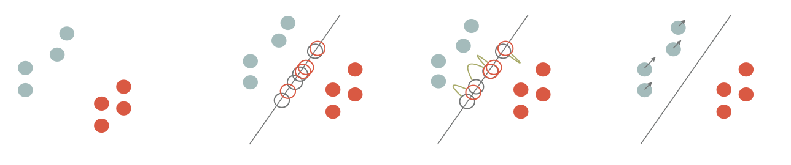
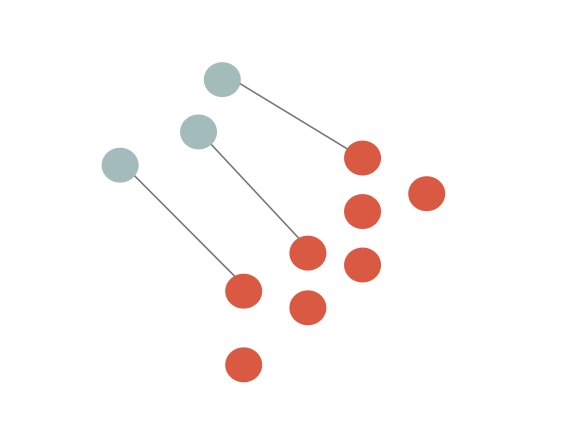
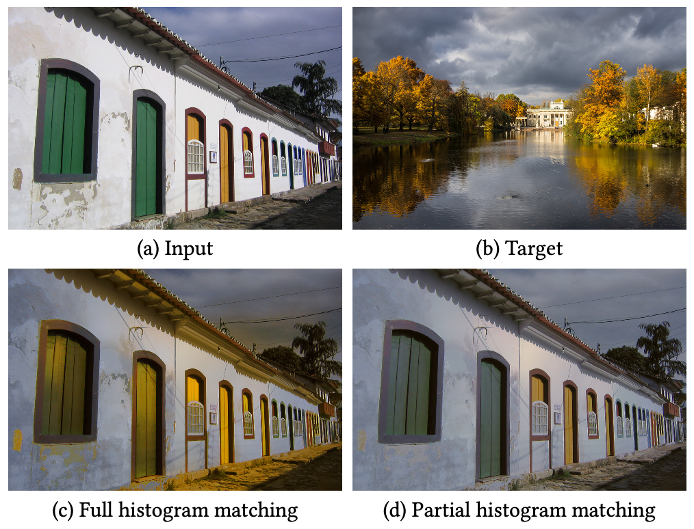

# Color Transfer via Sliced Optimal Transport

## Introduction

Color transfer is an image processing application where you want to retarget the
color histogram of an input image according to the color histogram of a target one.

Example:

Input image  | Target image | Color transfer output
-------|---------|----
 |  | 


The idea of this project is to detail a color transfer solution that considers
the [Optimal Transport](https://en.wikipedia.org/wiki/Transportation_theory_(mathematics)) as
a way to *deform* an histogram (empiric probability measure) is the most *efficient way* (see below for details). The literature is huge on the subject but I would like to emphasize the fact that
the implementation of these tools is not difficult.


This project contains both this documentation and some C++ codes that implement the color transfer with a few dependencies as possible.

## Building the code

To compile the tools, just clone the repository and use [cmake](http://cmake.org) to build
the project:

``` bash
git clone https://github.com/dcoeurjo/OTColorTransfer.git
cd OTColorTransfer
mkdir build ; cd build
cmake .. -DCMAKE_BUILD_TYPE=Release
make
```

Everything should compile on a modern C++ compiler. The only dependency is [OpenMP](http://openmp.org)
for multithread features that is included by default in most compiler.

On Apple MacOS, the default `clang` compiler is not shipped with OpenMP. Just install `omp` (`brew install omp`) and use the following `cmake` command line:

     cmake .. -DOpenMP_C_LIB_NAMES="omp" -DOpenMP_CXX_FLAGS="-Xpreprocessor -fopenmp \
              -I/usr/local/opt/libomp/include" -DOpenMP_CXX_LIB_NAMES="omp" \
              -DOpenMP_omp_LIBRARY=/usr/local/opt/libomp/lib/libomp.dylib \
              -DOpenMP_C_FLAGS="-Xpreprocessor -fopenmp -I/usr/local/opt/libomp/include"

## The theory:  Optimal transport and Sliced Optimal transport

As mentioned above, the key tool is Optimal Transport (OT for short) which can be sketched as follows: Given two  probability (Radon) measures $\mu\in X$ and $\nu\in Y$, and a *cost function* $c(\cdot,\cdot): X\times Y \rightarrow \mathbb{R}^+$, an optimal transport plan $T: X\rightarrow Y$ minimizes

$${\displaystyle \inf \left\{\left.\int _{X}c(x,T(x))\,\mathrm {d} \mu (x)\;\right|\;T_{*}(\mu )=\nu \right\}.}$$

The cost of the optimal transport defines a distance between Radon measure. We can define the  $p^{th}$ [Wasserstein distance](https://en.wikipedia.org/wiki/Wasserstein_metric), $\mathcal{W}_p(\mu,\nu)$ as

$$\displaystyle \mathcal{W}_{p}(\mu ,\nu ):={\left(\displaystyle \inf \left\{\left.\int _{X}c(x,T(x))^p\,\mathrm {d} \mu (x)\;\right|\;T_{*}(\mu )=\nu \right\}\right)^{1/p}}$$

An analogy with piles of sand is usually used to rephrase the definition: let us consider that $\mu$ is a pile of sand and $\nu$ a hole (with the same *mass*), if we consider that the cost of moving an elementary volume of sand from on point to the other is proportional to the Euclidean distance ($l_2$ cost function), then the optimal transport plan gives you the most efficient way to move all the sand from $\mu$ to $\nu$. Again, the literature is huge and there are many alternative definitions, please refer to [Computational Optimal Transport](https://optimaltransport.github.io/book/) for a more complete introduction to the subject.

The link between OT and color transfer follows the observation that color histogram are discrete Radon measures. As we are looking for the *most efficient* transformation of the input image histogram to match with the target one, the color transfer problem can be reformulate as a discrete OT one [^b1][^b2] [^b3][^b4][^b5][^b6].

There are many numerical solutions to compute the Optimal transport (with continuous, discrete, semi-discrete measures, w/o regularization...). We focus here on a **sliced** formulation of the OT and of the 2-Wasserstein metric in dimension $d$:

$$ SW(\mu,\nu)^2 := \int_{S^d} \mathcal{W}_2( P_{\theta,\sharp}\mu,P_{\theta,\sharp}\nu)^2 d\theta\,.$$

The sliced formulation consists in projecting the measures onto a 1D line ($P_{\theta,\sharp}: \mathbb{R}^d\rightarrow \mathbb{R}$), solving the 1D OT problem on the projections and average the results for all directions ($S^d$ unit sphere in dimension $d$).

If the measures are discrete as sum of Diracs centered at points $\{x_i\}$ and $\{y_i\}$ in $\mathbb{R}^d$, respectively ($\mu := \frac{1}{n}\sum_{x_i} \delta_{x_i}$, $\nu := \frac{1}{n}\sum_{y_i} \delta_{y_i}$), then the 1D OT is obtained by sorting the projections and computing the difference between the first projected points of $\mu$ with the first projected points of $\nu$, the second with the second, etc...

$$ SW(\mu,\nu)^2 = \int_{S^d} \left(|\langle  x_{\sigma_\theta(i)} - y_{\kappa_\theta(i)},\theta\rangle| ^2\right) d\theta\,,$$
($\sigma_\theta(i)$ a,d ${\kappa_\theta(i)}$ are permutations with increasing order).


Numerically, we sample the set of directions $S^d$ and thus consider a finite number of *slices*.

## Sliced OT Color Transfer

Back to our histogram transfer problem, Diracs centers $\{x_i\}$ are points in RGB space for all pixels of the input image, and  $\{y_i\}$ are the colors of the target image. Matching the histogram consists can be seen a transportation of the point cloud $\mu$ to $\nu$ in $\mathbb{R^3}$ (the RGB color space).

The idea is to advect points of $\mu$ such that the it minimizes $SW(\mu,\nu)$. As described in the literature[^b1][^b4], this amounts to project he points onto a random direction $\theta$, *algin* the sorted projections and advect $\mu$ in the $\theta$ direction by $|\langle  x_{\sigma_\theta(i)} - y_{\kappa_\theta(i)},\theta\rangle|$.




and we iterate. Note that instead of advecting $\mu$ for each $\theta$, we can accumulate advection vectors into a small batch and perform the transport step  once the batch is full[^b4]. For enough slices (see the code for the experiments), we end up with a retarged input image.

Note that the transport plan can be regularized using a simple post-processing, *e.g.* a bilateral filter of the transportation (difference between the input image and the retargeted one) which is then applied to the input image[^b4].  

## Sliced Partial Optimal Transport

The original sliced OT requires the measure to have the exact same number of Diracs ($e.g.$ input and target images must have the same size). When dealing with measures of different sizes, the combinatorial problem is more complex in the sense that we are not looking for a minimal cost bijective map between the Diracs, but an injective one. This problem is intensively discussed in the [Sliced Partial Optimal Transport](https://perso.liris.cnrs.fr/nicolas.bonneel/spot/) paper[^b6].




In color matching applications such as that of [Pitié et al. 2005][^b1], matching all pixels of an input image (a) seen as 3D points in an RGB space to all pixels of a target image (b) can lead to erroneous transfers (c) due to mismatched content (here, trees of the target are not present in the input, and distort colors in the output).



 [^b1]: Francois Pitié, Anil C. Kokaram, and Rozenn Dahyot. 2005. N-Dimensional Probablility Density Function Transfer and Its Application to Colour Transfer. In Proceedings of the Tenth IEEE International Conference on Computer Vision - Volume 2 (ICCV ’05). IEEE Computer Society, Washington, DC, USA, 1434–1439. https://doi.org/10.1109/ ICCV.2005.166
 [^b2]: François Pitié, Anil C Kokaram, and Rozenn Dahyot. 2007. Automated colour grading using colour distribution transfer. Computer Vision and Image Understanding 107, 1-2 (2007), 123–137.
 [^b3]: Nicolas Bonneel, Julien Rabin, G. Peyré, and Hanspeter Pfister. 2015. Sliced and Radon Wasserstein Barycenters of Measures. J. of Mathematical Imaging and Vision 51, 1 (2015).
 [^b4]: Julien Rabin, Julie Delon, and Yann Gousseau. 2010. Regularization of transportation maps for color and contrast transfer. In Image Processing (ICIP), 2010 17th IEEE International Conference on. IEEE, 1933–1936.
 [^b5]: Nicolas Bonneel, Kalyan Sunkavalli, Sylvain Paris, and Hanspeter Pfister. 2013. Example- Based Video Color Grading. ACM Trans. Graph. (SIGGRAPH) 32, 4 (2013).
 [^b6]: Nicolas Bonneel and David Coeurjolly. 2019. Sliced Partial Optimal Transport. ACM Trans. Graph. (SIGGRAPH) 38, 4 (2019).
